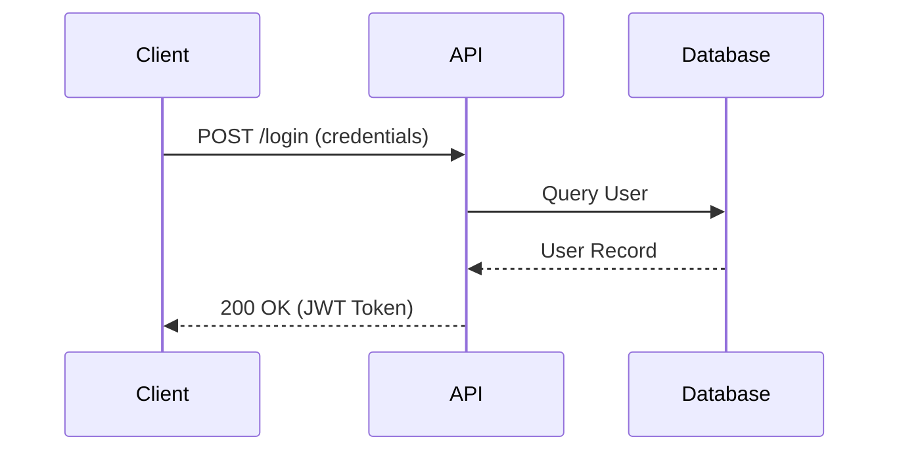

```mermaid
sequenceDiagram
    participant Client
    participant API
    participant Database
    Client->>API: POST /login (credentials)
    API->>Database: Query User
    Database-->>API: User Record
    API-->>Client: 200 OK (JWT Token)
```